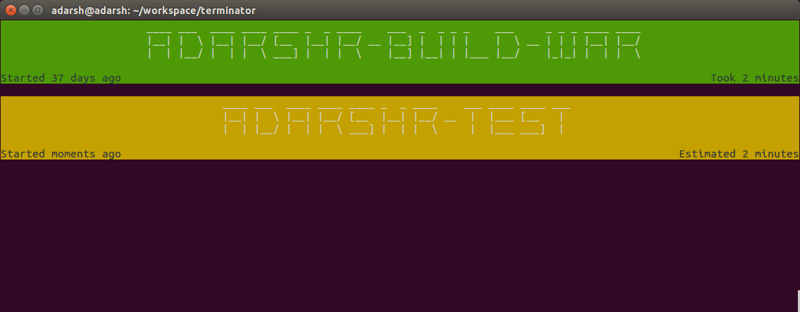
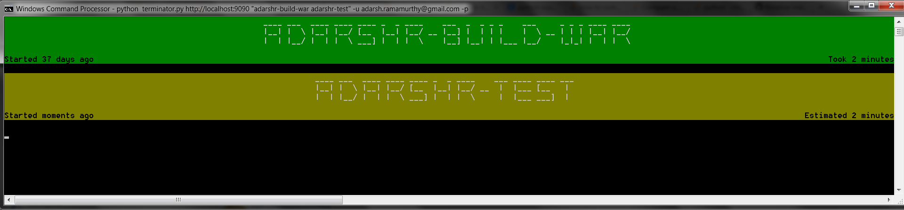

# terminator

An extremely lightweight terminal based Jenkins build monitor written using Python. Terminator is designed to be run on
low powered computers such as Raspberry Pi. Often it is more efficient and practical to use a terminal based build 
monitor than running a full fledged browser such as Epiphany or Firefox.


### Linux Terminal


  
### Windows Command Prompt




## Prerequisites

- Python 3.2 (but 3.4 is recommended)
- Pip 3

## Installation

Install all the requirements.

```bash
$ cd terminator
$ sudo pip install -r requirements.txt
```

## Usage to output the default view

```python
$ python -m terminator <jenkins url>
```

## To output another jenkins view

```python
$ python -m terminator <jenkins url> -v "view_name"
```

## To output a list of specific jobs

```python
$ python -m terminator <jenkins url> -j "job-1 job-2 job-3"
```

### To change the polling interval

```python
$ python -m terminator <jenkins url> -i INTERVAL
```

Here `INTERVAL` is in seconds.


### If your Jenkins needs authentication

```python
$ python -m terminator <jenkins url> -u USERNAME -p
```

### If your must override terminal width

```python
$ python -m terminator <jenkins url> -w WIDTH
```

Sometimes you might want to use `tput cols` to get the terminal width.

```python
$ python -m terminator <jenkins url> -w "$(tput cols)"
```

### If you don't like the default font

```python
$ python terminator <jenkins url> -f FONT
```

`FONT` can be one of the [pyfiglet fonts](https://github.com/pwaller/pyfiglet/tree/master/pyfiglet/fonts). Just make
sure that the font you choose does not break your terminal width.
